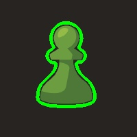
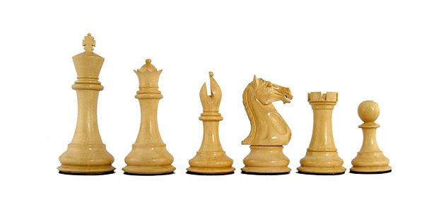

# Object Detection and Area calculation

This project is designed to detect objects in an image using OpenCV and display their contours and calculated areas. It works by first converting the image into grayscale, applying thresholding to separate objects from the background, and then finding the contours of those objects. The script draws bounding boxes around each detected object and overlays the calculated area on the image.

## Features

- Object detection using contours from OpenCV.
- Area calculation for each detected object.
- Bounding box drawn around each object with real-time area display.
- Saves the output image with bounding boxes and area annotations.

## Output

For single object:

For multiple objects

